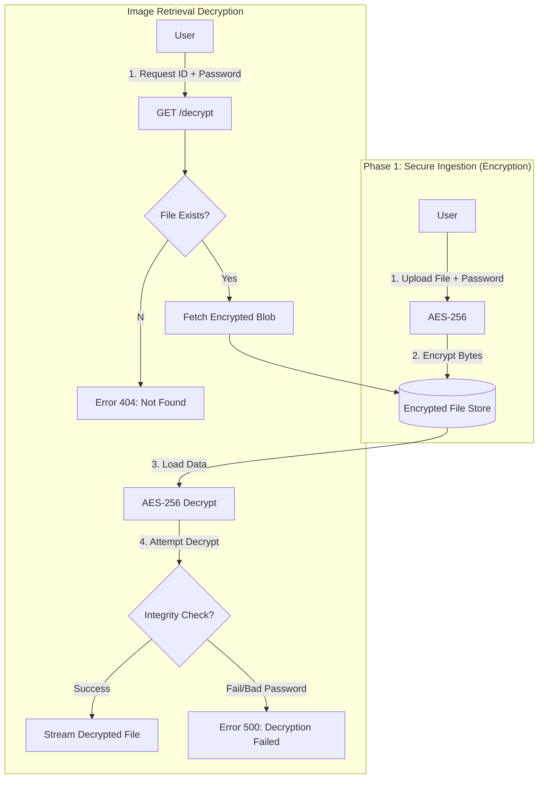

# EncryptedFileHost

Encrypt files or images in AES 256
Running in prod on https://i.moomoo.me

## What is this?
This service is a free (for now) encrypted file/image host. Files are encrypted with AES 256 then compressed with GZIP. No one can read your files without the encryption key, not even me.

Even if the servers were hacked no one would be able to see file contents unless AES 256 is somehow cracked in the future.

This is a fun project that I will try to keep free, however if it uses too much storage I may have to create restrictions.

Please note this service is NOT intended to be used for breaking the law. I only really made this to prevent others from eavesdropping on my images/files that could contain personal information or even credit cards.
(copy and pasted)

## How-To
Here's how to start everything
1. Clone this repo
2. Make a folder in the root directory called "files" (without the quotes)
3. Do 'npm install'
4. Then do 'node .'
5. Done!

## Credits
* **Backend & Architecture:** [moom0o](https://github.com/moom0o) - *API Design, Encryption, Client-Side interactions.*
* **UI/UX:** [Win](https://github.com/WinsDominoes) - *Visual design, CSS*

